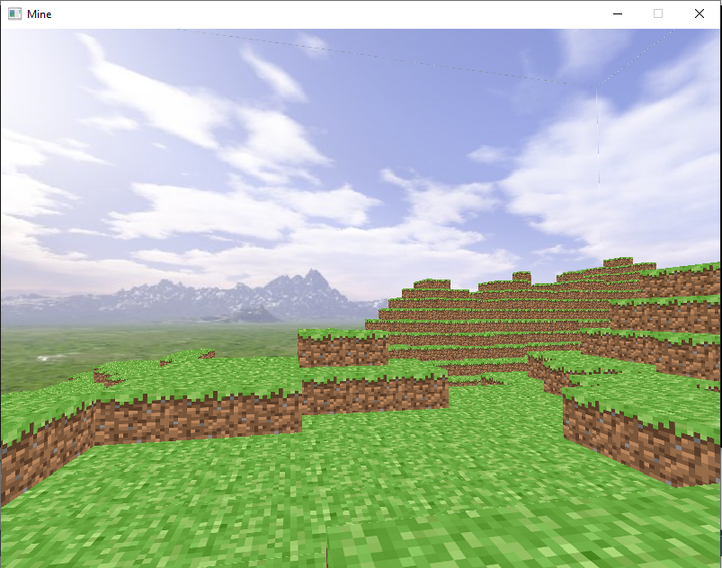

# sdlopenglmine
Minecraft style. W,S,A,D for movement. Mouse -> look. Left/right mouse button for adding/deleting blocks.
Adapted the code of youtuber FamTrinli to sdl. Had to change some things like flipping the textures and the way to obtain the color of a pixel for the heightmap.

Go and watch this video: https://www.youtube.com/watch?v=6RxIeguVLcM&t=607s

